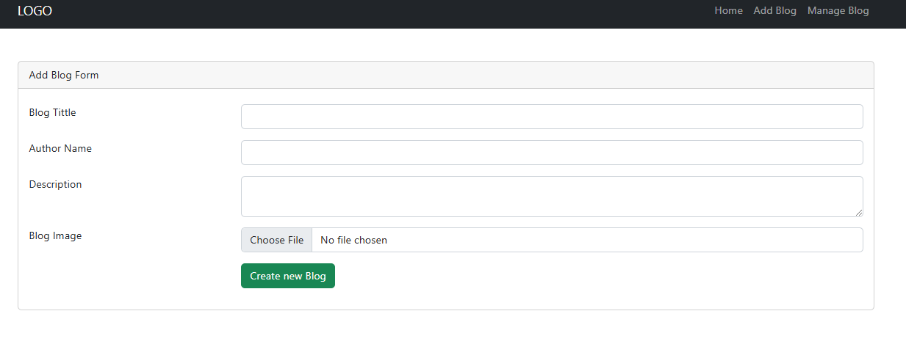

# Laravel CRUD Application

This project is a simple Laravel application that demonstrates the Create, Read, Update, and Delete (CRUD) operations using a database. It allows users to manage items in a database, perform searches, and navigate through data with pagination. 

---

## **Features**

- **Create**: Add new items to the database.
- **Read**: View a list of items with the ability to search and filter.
- **Update**: Edit existing items in the database.
- **Delete**: Remove items from the database.


---

## **Technologies Used**

- **Laravel**: PHP framework for building web applications.
- **Bootstrap**: Front-end framework for responsive and mobile-first design.
- **MySQL**: Database management system for storing item data.


---

## **Installation**

### **Prerequisites**

- **PHP** (Minimum version 7.4)
- **Composer** (Dependency Manager for PHP)
- **Node.js** and **npm** (Package manager for JavaScript)
- **MySQL** (Or any compatible database system)

### **Steps to Install**

1. **Clone the Repository**:
   ```bash
   git clone https://github.com/yourusername/CRUD-Operations
   cd laravel-crud-app
   ```

2. **Install Dependencies**:
   ```bash
   composer install or update
   ```

3. **Create a copy of the `.env` file**:
   ```bash
   cp .env.example .env
   ```

4. **Configure the Database**:
   Open the `.env` file and update the database configuration:
   ```bash
   DB_CONNECTION=mysql
   DB_HOST=127.0.0.1
   DB_PORT=3306
   DB_DATABASE=your_database_name
   DB_USERNAME=your_database_username
   DB_PASSWORD=your_database_password
   ```

5. **Generate an application key**:
   ```bash
   php artisan key:generate
   ```

6. **Run Migrations**:
   ```bash
   php artisan migrate
   ```

7. **Run the Development Server**:
   ```bash
   php artisan serve
   ```

Your Laravel CRUD application should now be accessible at `http://localhost:8000`.


---

## **Usage**

1. **Manage Items**:
   - From the dashboard, navigate to the "Items" page.
   - You will see a list of items with the ability to search, edit, delete, and paginate through the records.
   - Click "Add New Item" to create a new record.
   - Use the form to enter item details and save them to the database.


2. **Edit and Delete**:
   - Click the "Edit" button next to an item to modify its details.
   - Use the "Delete" button to remove an item from the database.
   - A confirmation modal will appear before deletion.



---

## **Contributions**

If you would like to contribute to this project, please follow these steps:

1. **Fork the repository**.
2. **Create a new branch** for your changes:
   ```bash
   git checkout -b feature-branch
   ```
3. **Make your changes** and commit them:
   ```bash
   git commit -am 'Add new feature'
   ```
4. **Push to your fork**:
   ```bash
   git push origin feature-branch
   ```
